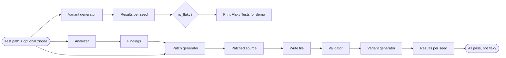

# PyIDFix: Architecture and Components

PyIDFix is a **library** used with **pytest**: normal development still runs `pytest` as usual. To **probe** or **re-check** a test, the tool runs **`python -m pytest`** in **subprocesses** with different environments (mainly `PYTHONHASHSEED`). The optional **pytest plugin** only registers the `pyidfix` marker; it does not change collection or execution of your suite.

## Architecture overview

Flow is **left → right**. From the same **test path** (and optional `file.py::test_name`), one branch **analyzes and patches**; the other (optional) **runs pytest under many hash seeds** before or after patching.

- **Top branch:** subprocess **pytest** with varying `PYTHONHASHSEED` → **results** → **is_flaky?** (mixed pass/fail ⇒ flaky).
- **Bottom branch:** **AST scan** → **findings**; **patch generator** also needs the file text (same path). **Validator** re-runs the **variant generator** on the **saved** patched file.

If your Markdown viewer does not render Mermaid, use the same structure: inputs on the **left**, outputs of each stage to the **right**, with the **variant** branch parallel to **analyze → patch → validate**.

---

## 1. Static pattern analyzer — `pyidfix/analyzer.py`

### Role

Turn a Python test file into a list of **structured warnings** (`Finding`) so later stages know **what** to fix and **where**.

### Input / output

| Input                                                          | Output                                 |
| -------------------------------------------------------------- | -------------------------------------- |
| File path (`analyze_file`) or source string (`analyze_source`) | `list[Finding]` (empty if unparseable) |

Each **`Finding`** carries `pattern`, `line`, `column`, `message`, `code_snippet`, and `function_name` when the hit is inside a `def`.

### Implementation (high level)

1. **`analyze_file`** reads the file and calls **`analyze_source`**.
2. **`analyze_source`** runs **`ast.parse`**. On `SyntaxError`, returns `[]`.
3. **`PatternVisitor`** (subclass of `ast.NodeVisitor`) walks the tree:
   - Tracks the current function name while inside `FunctionDef` / `AsyncFunctionDef`.
   - **`visit_Assign` / `visit_For`:** detect unordered dict/set-style iteration (`list(d.items())`, `for x in d.items():`, etc.) vs safe `sorted(...)`.
   - **`visit_Call` + end of function:** collect `random.*` calls; if the function never calls `random.seed`, emit `unseeded_randomness` findings.
   - **`visit_Assert`:** detect `assert expr == <float literal>`.

**AST in one sentence:** The AST is a tree of “what this code means” (loops, calls, asserts). Walking it avoids fragile regex on whole files and gives stable **line/column** for the patch step.

### Public API (summary)

| Symbol                                 | Purpose                                                         |
| -------------------------------------- | --------------------------------------------------------------- |
| `Finding`                              | Immutable record for one warning; `to_dict()` for logging/JSON. |
| `analyze_file(path)`                   | Entry point for a path on disk.                                 |
| `analyze_source(source, filename=...)` | Entry point for in-memory strings (tests, snippets).            |

**Downstream:** Findings are consumed by **`generate_patch`**. They are **not** required for **`run_test_with_variants`** (that only needs a pytest node id).

---

## 2. Execution variant generator — `pyidfix/variant_generator.py`

### Role

Run **one** pytest selection (`file.py` or `file.py::test_name`) **repeatedly**, each time with a different **`PYTHONHASHSEED`**, and record whether the test **passed** or **failed**.

### Input / output

| Input                                                                                            | Output                |
| ------------------------------------------------------------------------------------------------ | --------------------- |
| `test_path` (string), optional `hash_seeds`, `cwd`, `python_executable`, optional `random_seeds` | `list[VariantResult]` |

Each **`VariantResult`** holds `variant_key`, `passed`, `stdout`, `stderr`, `return_code`.

### Implementation (high level)

1. **`run_test_with_variants`** chooses **`cwd`** (for `eval_dataset` layouts, the small **program root** so imports work) and rewrites the path to a **pytest-relative** node id.
2. For each seed, it sets **`PYTHONHASHSEED`** in **`os.environ`**, then **`_run_pytest`** runs **`subprocess.run([python, "-m", "pytest", target, ...])`** with that env.
3. Optional **`random_seeds`:** sets **`PYIDFIX_RANDOM_SEED`** in the env; the **test code** must read it— the generator does not inject behavior into Python’s `random` module by itself.

**`is_flaky(results)`** returns **`True`** only if there are at least two results and **both** pass and fail appear (outcome depends on environment).

### Public API (summary)

| Symbol                        | Purpose                                                     |
| ----------------------------- | ----------------------------------------------------------- |
| `VariantResult`               | One row in the variant table.                               |
| `run_test_with_variants(...)` | Main entry: hash-seed sweep (+ optional random env passes). |
| `is_flaky(results)`           | Summarize whether outcomes differ across variants.          |

**Downstream:** **`validate_patched_test`** calls **`run_test_with_variants`** internally. Callers can also use it **before** patching for demos or metrics.

---

## 3. Deterministic patch generator — `pyidfix/patch_generator.py`

### Role

Apply **fixed rules** to the **source text** of a test file so that flagged patterns become more deterministic (`sorted`, `random.seed`, `pytest.approx`).

### Input / output

| Input                                         | Output                                                         |
| --------------------------------------------- | -------------------------------------------------------------- |
| Full file **source string** + `list[Finding]` | Single **patched** source string (unchanged if findings empty) |

### Implementation (high level)

1. **`generate_patch`** sorts findings by **line descending** so editing line N does not shift line numbers still to be patched.
2. For each finding, **`_apply_patch_for_finding`** dispatches to a private helper by **`pattern`**:
   - **unordered_iteration:** edit the **line** containing the finding—regex / string replace (`list(` → `sorted(`, wrap `for ... in d.items():`, etc.).
   - **unseeded_randomness:** **`ast.parse`** the file to find the **`FunctionDef`** by name, then **insert** a `random.seed(42)` line at the start of the body (text splice into `lines`).
   - **float_equality:** regex on the assert line for `pytest.approx`, add **`import pytest`** if missing.

The patcher is **text-first** for most rules; only the randomness helper uses the AST to locate a function body reliably.

### Public API (summary)

| Symbol                             | Purpose                                                                        |
| ---------------------------------- | ------------------------------------------------------------------------------ |
| `generate_patch(source, findings)` | Patch from string + findings (typical when you already have source in memory). |
| `patch_file(path, findings)`       | Read file, then `generate_patch`.                                              |

**Downstream:** Caller **writes** the returned string to a path; that path is what **`validate_patched_test`** uses.

---

## 4. Determinism validator — `pyidfix/validator.py`

### Role

After patching, answer: **does this test pass on every hash seed and stay non-flaky?**

### Input / output

| Input                                                                    | Output                                                                         |
| ------------------------------------------------------------------------ | ------------------------------------------------------------------------------ |
| Pytest path to **patched** file + `::test`, optional `hash_seeds`, `cwd` | **`(True, results)`** if all passed and not flaky; else **`(False, results)`** |

### Implementation (high level)

**`validate_patched_test`** calls **`run_test_with_variants`** with the same default seed grid, then requires **`all(r.passed)`** and **`not is_flaky(results)`**.

**`validate_patched_file`** loops test names and calls **`validate_patched_test`** for each.

### Public API (summary)

| Symbol                                       | Purpose              |
| -------------------------------------------- | -------------------- |
| `validate_patched_test(...)`                 | Single test node id. |
| `validate_patched_file(path, test_ids, ...)` | Batch helper.        |

---

## 5. Pipeline helper and pytest plugin — `pyidfix/run.py`, `pyidfix/plugin.py`

### `run_pipeline` (`run.py`)

| Input             | Output                                                             |
| ----------------- | ------------------------------------------------------------------ |
| Path to test file | **`PipelineResult`**: `findings`, optional `patched_source` string |

Today it **analyzes** and **builds patched source** for the whole file’s findings. It does **not** write files or call the validator; a full narrated CLI is described in **`NEXT_STEPS.md`**.

### `plugin.py`

Registers the **`pyidfix`** pytest marker in **`pytest_configure`**. No other hooks.

---

## 6. Tests and sample data

- **`tests/`** — Pytest tests for the library; they call the APIs above and often use files under **`eval_dataset/programs/`** as examples.
- **`eval_dataset/programs/`** — Small programs with intentional flaky tests and **`ground_truth.json`** for evaluation.

---

## 7. Pattern taxonomy (what the analyzer looks for)

| `pattern`             | Meaning                                                                         |
| --------------------- | ------------------------------------------------------------------------------- |
| `unordered_iteration` | Dict views or sets used in a way that assumes iteration order without `sorted`. |
| `unseeded_randomness` | `random.*` in a function body without `random.seed` in that same function.      |
| `float_equality`      | `assert` comparing to a float literal without `pytest.approx`.                  |

The tool does **not** implement separate detectors for time, filesystem APIs, or other proposal extras; see **`NEXT_STEPS.md`** for demo and evaluation plans.
